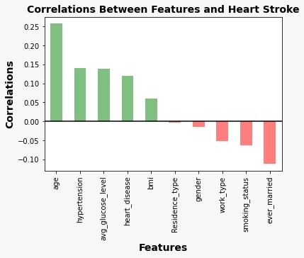

# 1.Introduction:The-Project-Stroke-Prediction
This project utilizes real-world and synthetic datasets to predict stroke events by analyzing clinical features. The aim is to determine the most key risk factors for strokes by investigating parameters like gender, age, hypertension, heart disease, and lifestyle choices.


## 2.Data
### Data Source
**Dataset:**: 
Stroke Prediction Dataset from Kaggle website\
[Kaggle Dataset 1](https://www.kaggle.com/datasets/fedesoriano/stroke-prediction-dataset)\
[Kaggle Dataset 2](https://www.kaggle.com/competitions/playground-series-s3e2/data)
1) id: Patient ID 
2) gender: "Male", "Female" or "Other"  
3) age: patient age  
4) hypertension: 0 if the patient does not have hypertension, 1 if the patient does not have hypertension  
5) heart_disease: 0 if the patient does not have heart disease, 1 if the patient has heart disease
6) ever_married: "No" or "Yes" 
7) work_type: "children", "Govt_jov", "Never_worked", "Private" or "Self-employed"  
8) Residence_type: "Rural" or "Urban"  
9) avg_glucose_level: average blood sugar  
10) bmi: body mass index
11) smoking_status: "formerly smoked", "never smoked", "smokes" or "Unknown"
### Data Cleaning
In this project, we perform data cleaning to ensure the dataset is ready for analysis.\
Missing values in the ’bmi’ column was filled with the
mean values which are calculated separately for the cases with and without strokes.
### Encoding the Variables
To work with categorical variables for further analysis, data encoding was used. Converting categorical
variables into numerical format using the factorize function, enhances the datasets’ relevance for
modelling.
### Data Analysis
Getting the correlation between features.\

## Requirements

To install requirements:

```setup
install -r requirements.txt
```

> The healthcare-dataset-stroke-data.csv data from [Kaggle](https://www.kaggle.com/datasets/fedesoriano/stroke-prediction-dataset) is used.

## Evaluation

To evaluate my model on ImageNet, run:

```eval
python eval.py --model-file mymodel.pth --benchmark imagenet
```

>📋  Describe how to evaluate the trained models on benchmarks reported in the paper, give commands that produce the results (section below).

## Pre-trained Models

You can download pretrained models here:

- [My awesome model](https://drive.google.com/mymodel.pth) trained on ImageNet using parameters x,y,z. 

>📋  Give a link to where/how the pretrained models can be downloaded and how they were trained (if applicable).  Alternatively you can have an additional column in your results table with a link to the models.

## Results

Our model achieves the following performance on :

|Classification algorithm|	Accuracy | Accuracy with hyperparameter tuning|
|------------------------|----------|:----------:|
|GradientBoostingClassifier	|	83.73%|	83.73%|
|LogisticRegression|	79.20%	|79.47%|
|RandomForestClassifier	|99.32%| 99.32%	|
|SVC |79.58%|	|
|DecisionTreeClassifier|	98.00%	| 98.16% |
|XGBClassifier	| 95.16% |


>📋  Include a table of results from your paper, and link back to the leaderboard for clarity and context. If your main result is a figure, include that figure and link to the command or notebook to reproduce it. 


## Contributing

>📋  Pick a licence and describe how to contribute to your code repository. 
