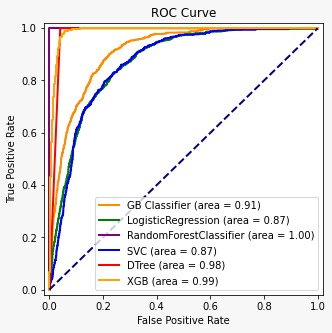

# The-Project-Stroke-Prediction
This project utilizes real-world and synthetic datasets to predict stroke events by analyzing clinical features. The aim is to determine the most key risk factors for strokes by investigating parameters like gender, age, hypertension, heart disease, and lifestyle choices.
## Data


## Requirements

To install requirements:

```setup
install -r requirements.txt
```

> The healthcare-dataset-stroke-data.csv data from [Kaggle](https://www.kaggle.com/datasets/fedesoriano/stroke-prediction-dataset) is used.

## Evaluation

To evaluate my model on ImageNet, run:

```eval
python eval.py --model-file mymodel.pth --benchmark imagenet
```

>📋  Describe how to evaluate the trained models on benchmarks reported in the paper, give commands that produce the results (section below).

## Pre-trained Models

You can download pretrained models here:

- [My awesome model](https://drive.google.com/mymodel.pth) trained on ImageNet using parameters x,y,z. 

>📋  Give a link to where/how the pretrained models can be downloaded and how they were trained (if applicable).  Alternatively you can have an additional column in your results table with a link to the models.

## Results

Our model achieves the following performance on :

|Classification algorithm|	Accuracy | Accuracy with hyperparameter|
|------------------------|----------|----------|
|GradientBoostingClassifier	|	83.73%|	83.73%|
|LogisticRegression|	79.20%	|79.47%|
|RandomForestClassifier	|99.32%| 99.32%	|
|SVC |79.58%|	|
|DecisionTreeClassifier|	98.00%	|98.16% |
|XGBClassifier	| 95.16% |




>📋  Include a table of results from your paper, and link back to the leaderboard for clarity and context. If your main result is a figure, include that figure and link to the command or notebook to reproduce it. 


## Contributing

>📋  Pick a licence and describe how to contribute to your code repository. 
